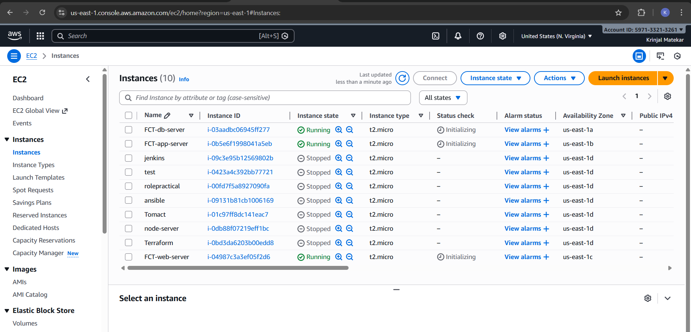
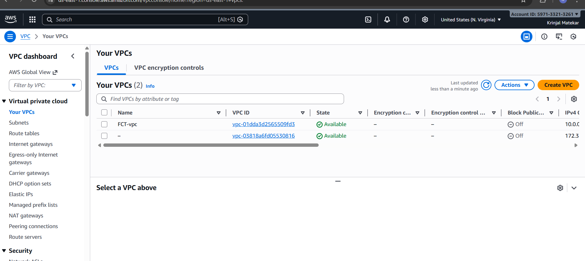
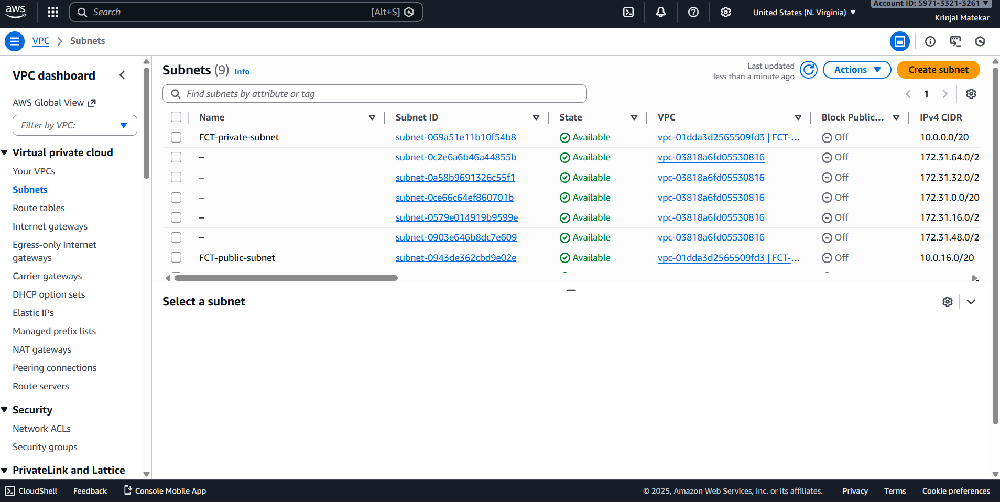
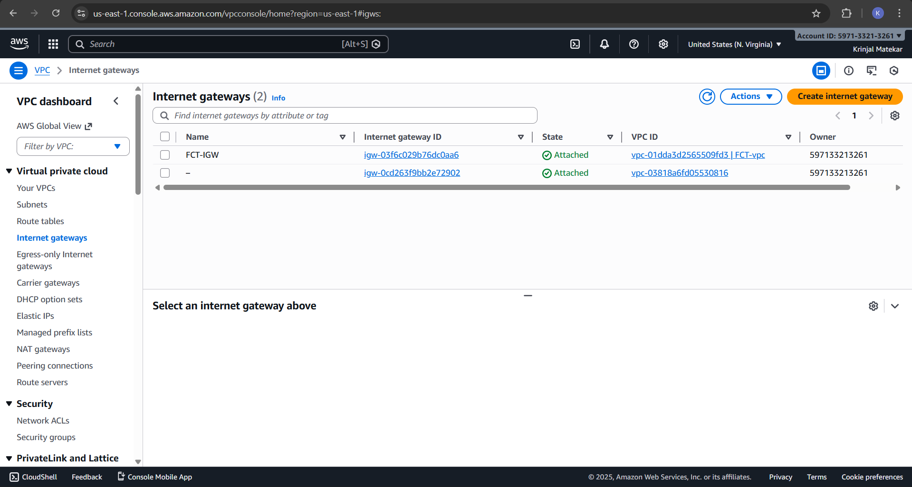
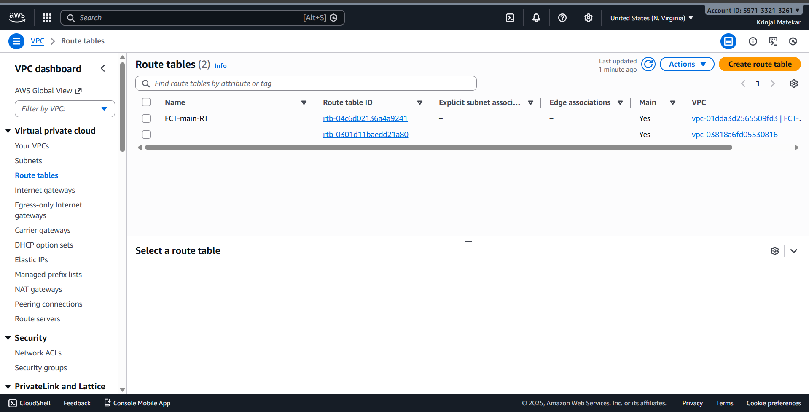

## 🔹 What is Three-Tier Architecture?

A three-tier architecture separates an application into three logical layers to improve security, scalability, and maintainability.

* The three tiers are:

1. Web Tier (Frontend)

2. Application Tier (Backend)

3. Database Tier
----

### 🔹 Tools & Technologies Used

* AWS EC2

* VPC

* Public & Private Subnets

* Security Groups

* Internet Gateway & NAT Gateway

* Terraform

* GitHub

* Linux (Amazon Linux)

* Nginx / Application Server

* MySQL / DB Server

----
### 🔹 Architecture Overview (High Level)
```
Internet
   |
[ Internet Gateway ]
   |
[ Web Server (Public Subnet) ]
   |
[ App Server (Private Subnet) ]
   |
[ DB Server (Private Subnet) ]
```
---
### 🔹 Step-by-Step Explanation :
#### Step 1: EC2 Instances Creation Using Terraform
### Web Tier (Public EC2)

* Deployed in public subnet

* Installed Nginx

* Acts as frontend / load entry point

### App Tier (Private EC2)

* Deployed in private subnet

* Handles application logic

* Receives traffic from web tier only

### DB Tier (Private EC2)

* Deployed in private subnet

* Database installed (MySQL)

* Accessible only from app tier



---
#### Step 2: Created a VPC

* Created a custom VPC to isolate resources
* Defined CIDR block (example: 10.0.0.0/16)
* This VPC is the foundation of the architecture


---

#### Step 3: Created Subnets
1. Public Subnet

* Used for Web Tier
* Has access to the internet
* Web server (EC2) deployed here

2. Private Subnets

* Used for App Tier & DB Tier
* No direct internet access
* Improves security



---
#### Step 4: Internet Gateway & Route Tables

* Internet Gateway attached to VPC

* Route table configured:

* Public subnet → Internet Gateway

* Private subnet → NAT Gateway (if used)





---

#### Step 5: Security Groups (Most Important)

Created separate security groups for each tier.
### Web Server Security Group :
* Allow:

1. HTTP (80)
2. HTTPS (443)
3. SSH (22) — restricted
* Open to public internet

### App Server Security Group:

* Allow traffic only from Web Server
* Example: Port 8080 / 3000
Database Security Group

### Allow traffic only from App Server

* Example: MySQL (3306)
* ✔ This ensures tier-to-tier communication only

---
#### Step 6: Terraform Workflow Used
```
terraform init
terraform plan
terraform apply --auto-approve
terraform destroy
```
----
### ✔ Fully automated infrastructure lifecycle

____

### KRINJAL M.